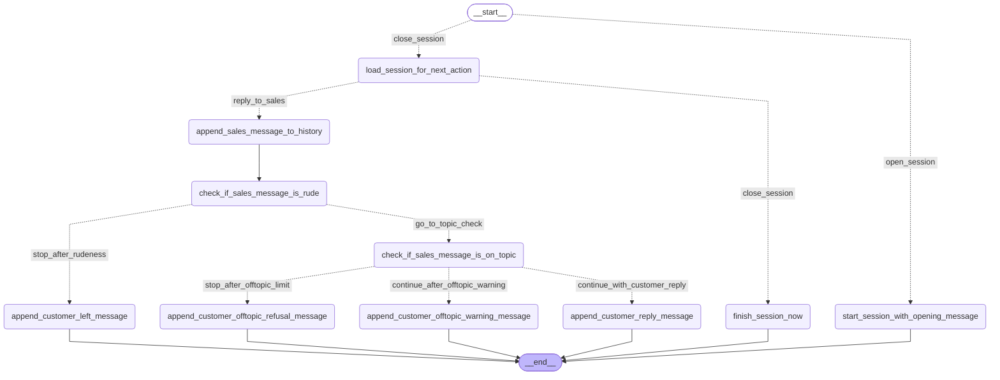

# Simulator Graph

```mermaid
---
config:
  flowchart:
    curve: linear
---
graph TD;
	__start__([<p>__start__</p>]):::first
	start_session_with_opening_message(start_session_with_opening_message)
	load_session_for_next_action(load_session_for_next_action)
	append_sales_message_to_history(append_sales_message_to_history)
	check_if_sales_message_is_rude(check_if_sales_message_is_rude)
	append_customer_left_message(append_customer_left_message)
	check_if_sales_message_is_on_topic(check_if_sales_message_is_on_topic)
	append_customer_offtopic_warning_message(append_customer_offtopic_warning_message)
	append_customer_offtopic_refusal_message(append_customer_offtopic_refusal_message)
	append_customer_reply_message(append_customer_reply_message)
	finish_session_now(finish_session_now)
	__end__([<p>__end__</p>]):::last
	__start__ -. &nbsp;close_session&nbsp; .-> load_session_for_next_action;
	__start__ -. &nbsp;open_session&nbsp; .-> start_session_with_opening_message;
	append_sales_message_to_history --> check_if_sales_message_is_rude;
	check_if_sales_message_is_on_topic -. &nbsp;stop_after_offtopic_limit&nbsp; .-> append_customer_offtopic_refusal_message;
	check_if_sales_message_is_on_topic -. &nbsp;continue_after_offtopic_warning&nbsp; .-> append_customer_offtopic_warning_message;
	check_if_sales_message_is_on_topic -. &nbsp;continue_with_customer_reply&nbsp; .-> append_customer_reply_message;
	check_if_sales_message_is_rude -. &nbsp;stop_after_rudeness&nbsp; .-> append_customer_left_message;
	check_if_sales_message_is_rude -. &nbsp;go_to_topic_check&nbsp; .-> check_if_sales_message_is_on_topic;
	load_session_for_next_action -. &nbsp;reply_to_sales&nbsp; .-> append_sales_message_to_history;
	load_session_for_next_action -. &nbsp;close_session&nbsp; .-> finish_session_now;
	append_customer_left_message --> __end__;
	append_customer_offtopic_refusal_message --> __end__;
	append_customer_offtopic_warning_message --> __end__;
	append_customer_reply_message --> __end__;
	finish_session_now --> __end__;
	start_session_with_opening_message --> __end__;
	classDef default fill:#f2f0ff,line-height:1.2
	classDef first fill-opacity:0
	classDef last fill:#bfb6fc

```
